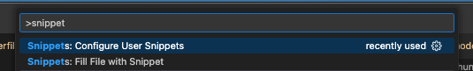
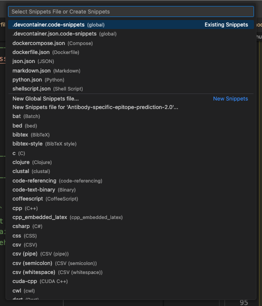

# Convert2vscSnippet
a simple shell script to convert a piece of code to vscode snippet 

## Usage
Grant execution permission 
```shell
$ chmod +x convert2snippet.sh 
```

For small pieces of code, use the interactive version
```shell
$ ./convert2snippet.sh
Enter text (Ctrl-D to finish):
RUN conda install pandas 
"RUN conda install pandas ",
```

For big chunk of code, use a file as input 
save the following as a file with random name e.g. `raw` 
```plaintext 
# Default to root only access to the Docker socket, set up non-root init script
RUN touch /var/run/docker-host.sock \
    && ln -s /var/run/docker-host.sock /var/run/docker.sock \
    && apt-get update \
    && apt-get -y install socat
```

pass the file location to the script
```shell 
$ ./convert2snippet.sh raw 
```
stdout:
```
"# Default to root only access to the Docker socket, set up non-root init script",
"RUN touch /var/run/docker-host.sock \\",
"    && ln -s /var/run/docker-host.sock /var/run/docker.sock \\",
"    && apt-get update \\",
"    && apt-get -y install socat",
```
These are ready to place inside vscode snippet json file 

Open vscode Command Palette, use the key combination `Cmd + Shift + P` (on Mac), `Ctrl + Shift + P` (Windows). Search for snippet 



Then select `Preferences: Configure User Snippets` and select the language you want to add the snippet to or create a new one.


